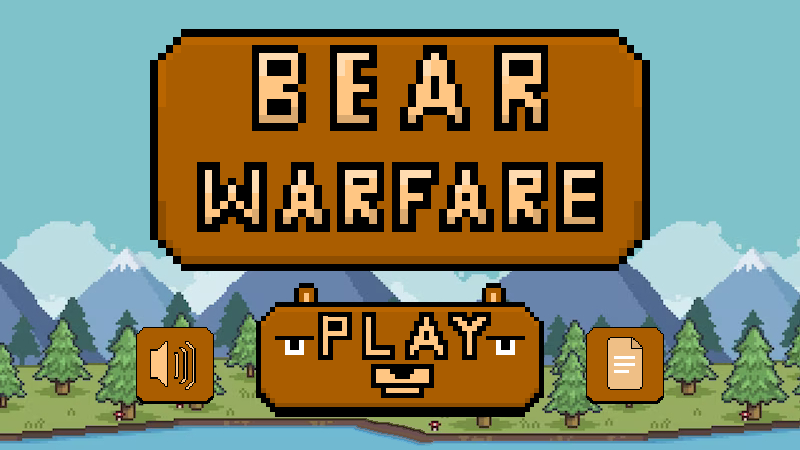

# Bear Warfare

## Project Setup Preface
This project requires setting up a local web server as a way to safely and securely serve files. [Phaser](https://phaser.io/) is the JavaScript game development library of choice for this project. 

## XAMPP
The recommended web server for this project is XAMPP. If you don't know how to install XAMPP, find a guide on the internet for your operating system. In order to use XAMPP, and therefore this project, ensure that the Apache web server as part of XAMPP, is up and running.
* Windows/Mac: Open up the GUI app
* Arch Linux: sudo xampp start

Once XAMPP is installed, clone this repository to a location of your choosing. See next section considerations on where you should clone the repository to.
* `git clone https://github.com/dreadvisage/Bear-Warfare`

## Making the Website Accessible by XAMPP (Required)
* You have two main options when helping XAMPP find this website. Options 1 or 2.
    * Moving the project folder to `<XAMPP_install_path>/XAMPP/htdocs/Bear-Warfare` 
    * Creating a soft link at `<XAMPP_install_path>/XAMPP/htdocs/super_cool_soft_link` and having this project folder be installed most anywhere on your system.
* Here in an example command for UNIX-based operating systems for soft-link creation. 
    * `ln -s <this_project_path>/Bear-Warfare <XAMPP_install_path>/XAMPP/htdocs/<your_soft_link_name>`. 
    * By doing this, you can navigate to the website by using the soft link name. e.g. `localhost/<your_soft_link_name>`.

Note. Please ensure XAMPP has permissions to access this project's directory. Otherwise, you won't be able to run the website.

## Visual Studio Code Development Setup
The recommended IDE for this project's development is Visual Studio Code. If you don't know how to install VSCode, find a guide on the internet for your operating system. Using VSCode, feel free to open the CS355GroupProject folder that you cloned. Once VSCode is installed, install the recommended extensions.
* Code Spell Checker
    * Simple spell checking added to VSCode. Nice and convenient, but not needed.
* IntelliCode
* npm Intellisense
    * Allows the use of locally installed npm packages for autocomplete and suggesions as you type
* Path Intellisense
    * Tries to autocomplete filesystem paths for you
* Live Server
    * Very useful for speeding up workflow. e.g. Opening `index.html` as a Live Server through VSCode allows you to see changes as you save your files, instead of having to reload the webpage

## Using Phaser with VSCode
[Phaser](https://phaser.io/) is the JavaScript game development library of choice for this project. There are two ways you can use Phaser, and you should use both simultaneously when developing.
* Import the CDN in the header of the HTML. Minimum version for this project is Phaser 3.70: https://cdn.jsdelivr.net/npm/phaser@3.70.0/dist/phaser.min.js
    * This is quick and easy, and needed if you want to actually present this project as a standalone website
* Install Phaser node modules from the npm package manager.
    * This is a little more involved, but absolutely required for speeding up workflow. See next section for install instructions
 
## Setting up Phaser Autocomplete and Suggesions in VSCode
In order to get autocomplete working in VSCode, you must first install the NPM package manager for your system.
* Windows: https://nodejs.org/en/download/
* Mac: https://nodejs.org/en/download/
* Arch Linux: sudo pacman -S npm

~~Once installed, open VSCode. Next, open a terminal inside VSCode~~
* ~~Terminal → New Terminal~~
* ~~Initialize npm~~
    * ~~`npm init`~~
    * ~~You can answer these questions how you like. You can leave them as the defaults/blank if you don’t know what to put.~~
* Then, you can actually install Phaser through npm
    * `npm install phaser`
* Note that autocomplete will only work inside standalone JavaScript files. Writing JavaScript embedded in HTML files will not present you with suggestions.
